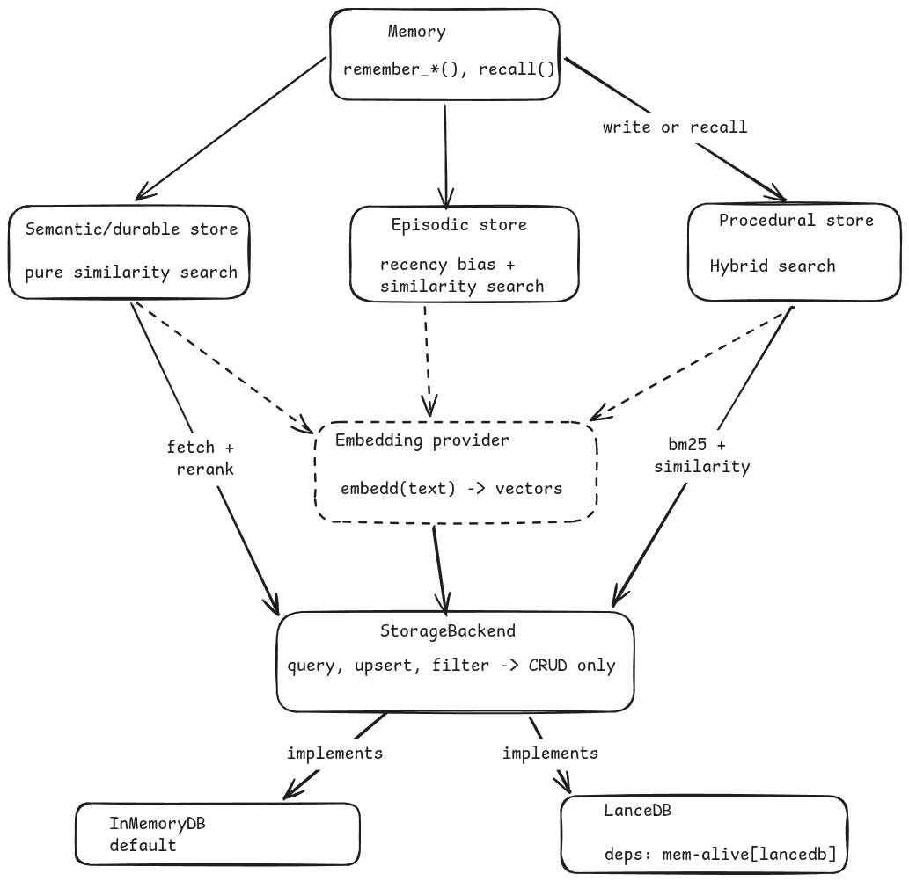

# mem-alive

A memory layer for AI agents. Semantic, episodic, and procedural memory, built as a Python package.

## Why

Coding agents re-read the whole codebase every time they start a task. That burns tokens and adds round trips between the cloud model and the local harness. This library exists to fix that by giving agents actual memory instead of a blank slate every session.

That said, it's not built just for coding agents. It's a general memory layer that works with any agentic setup or a plain RAG app. The coding-agent problem is the flagship test case, not something baked into the core.

## Architecture

One `Memory` client fronts three stores, each backed by the same pluggable `StorageBackend` and `EmbeddingProvider`.

## Three kinds of memory

- **Semantic** - durable facts, no recency weighting. New facts can supersede old, similar ones.
- **Episodic** - specific past events, timestamped, recency-weighted (exponential half-life decay), never merged.
- **Procedural** - skills and workflows, retrieved by hybrid search (embedding similarity + keyword overlap).

Each type has its own store with its own retrieval logic, but all three share one schema and one `memory_type` tag, so a single federated `recall()` on the `Memory` client can query across all of them at once.

## Scoping

- `namespace` - hard partition, never crossed. Means whatever the caller wants (agent, repo, tenant).
- `metadata` - flexible filters within a namespace (session id, tags, etc).

## Contradictions

Semantic writes check for contradictions on every `remember()`: embed the new fact, search for similar existing facts in the same namespace, and if similarity crosses a threshold, mark the old fact as superseded. v0.1 uses a similarity threshold for this. A smarter LLM-arbiter version (duplicate vs contradiction vs refinement) is a future upgrade, not required for the first release.

## Storage

The backend stays dumb: vector search, metadata filters, CRUD, nothing else. Recency decay, hybrid scoring, and contradiction logic all live above it, in the store layer, so any backend stays swappable.

v0.1 ships with `InMemoryBackend`, zero dependencies, good for development and testing. A `LanceDB` backend (embedded, no server required) is planned as an optional extra (`pip install mem-alive[lancedb]`) for anything that needs to persist across restarts.

## Status

v0.1.0. Core is done: all three stores, the in-memory backend, a local embedding provider (Ollama), and the federated `Memory` client, all async, with a test suite covering each module plus the integration path. MIT licensed.

Still open: the LanceDB backend, a coding-agent app layer built on top, and eval/benchmark design.
